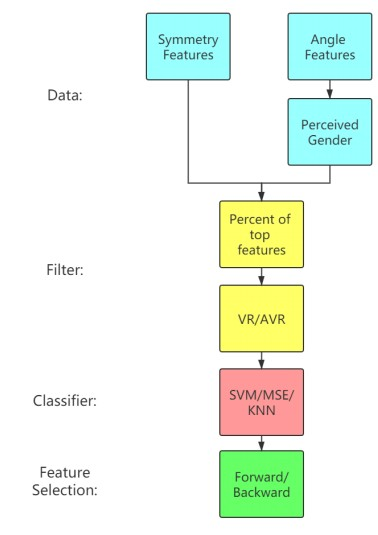
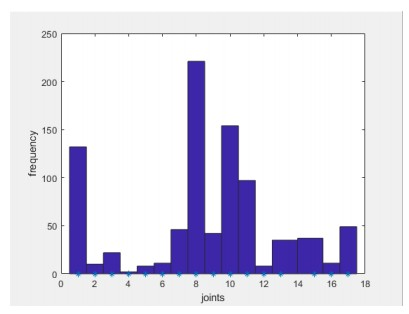

# JamaicanDancer_GenderClassification
Do gender classification on dancer dataset, which consist of motion capture data of the Jamaican dancers.

There are two forms of features, Angle values of 17 joint and symmetry features calculated
from angle.

[Angle values](https://drive.google.com/file/d/1Hs9gVyyJikLS_cHKtT1pgfgCt1WC354S/view?usp=sharing)

17(joint) x 3,000(frames) x 3(d.v.a) x 172(subjects)
where ground truth is perceived gender score(range from 0 to 1)

[Symmetry features](https://drive.google.com/file/d/1gMnWaAHm840SYCjn27rN4f_BKsJ1KH8G/view?usp=sharing)

21 H (x,y,z) and 30 V, 30 T, 21 R,21 G(with 50 different time window size)
where ground truth is gender label(1 or 2)

For two dataset, we choose different filters, classifiers and feature selection algorithms, to maximize the
classification accuracy.
Every time using different methods, we randomly split dataset into train data(80%) and test
data(20%), and repeatedly run 50 times to get average rate.

After feature selection, we can find up to 1000 most discriminative features(depends on iteration times), then operate on these features(like cluster), which could lead to a better result.
